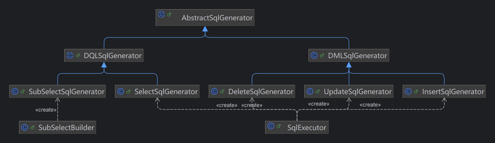
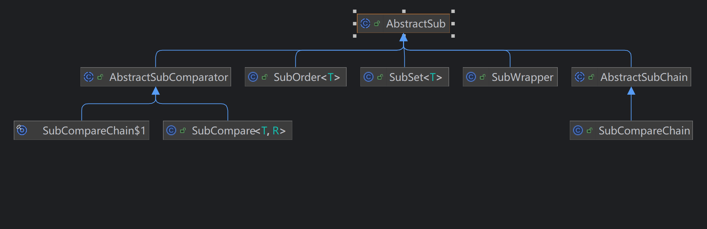
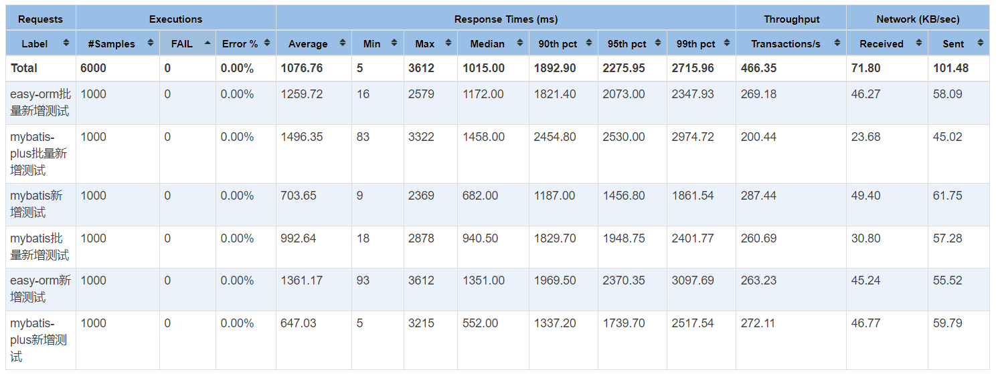

# 简介
easy-orm是一款简洁、轻量高效的数据库对象关系映射框架，它的代码编写规范基于SQL语义，学习成本低，可以快速掌握。

下图是与业界mybatis-plus框架相比。

| 功能     | mybatis-plus | easy-orm |
|--------|-------------|----------|
| 单表CRUD | √           | √        |
| 多表CRUD | ×           | √        |
| 子查询    | x           | √        |
| 多数据源   | ×           | √        |
| 预编译    | √           | √        |

easy-orm不需要做任何前置工作，开箱即用，以下给出easy-orm的基本使用方式。

## 注册数据源
用户可以任意选择接入的连接池，以HikariCP为例，用户可以在任意地方获取到数据源。
```java
    HikariConfig config = new HikariConfig();
    config.setJdbcUrl("jdbc:mysql://localhost:3306/test");
    config.setUsername("root");
    config.setPassword("xxxxxx");
    // easy-orm支持注册多数据源，此处注册了名为mysql的数据源，并且设置为默认数据源
    SqlConnectFactory.register("mysql", new HikariDataSource(config), true);
```

## 1. 查询
在实体类上添加@Table注解指定表名与数据库表相关联。
> 查询出所有姓张的学生，并且是18到30岁以内
```java
List<StudentModel> studentModels = SqlExecutor.builder().selectChain()
        //.select() 等于 select *
        .select(StudentModel::getId, StudentModel::getName, StudentModel::getAge)
        .from(StudentModel.class)
        .where(SubUtil.like(StudentModel::getName, "张%").and().between(StudentModel::getAge, 18, 30))
        .list(StudentModel.class);

System.out.println(studentModels);

// 控制台输出
22:18:05.754 [Test worker] DEBUG com.coderevolt.sql.core.dql.DQLSqlGenerator - ==> execute sql: SELECT studentModel.id,studentModel.name,studentModel.age FROM student studentModel WHERE studentModel.name LIKE (?) AND studentModel.age BETWEEN ? AND ?
22:18:05.754 [Test worker] DEBUG com.coderevolt.sql.core.dql.DQLSqlGenerator - ==> param1=张%, param2=18, param3=30
22:18:07.336 [Test worker] DEBUG com.coderevolt.sql.core.dql.DQLSqlGenerator - <==  total:2
[StudentModel{id='6', name='张三', age='26'}, StudentModel{id='7', name='张玉立', age='19'}]
```
## 2.更新
> 更新张三的年龄为18
```java
boolean result = SqlExecutor.builder().updateChain()
                .update(StudentModel.class)
                .set(SubUtil.set(StudentModel::getAge, 18))
                .where(SubUtil.eq(StudentModel::getName, "张三"))
                .exec();

System.out.println("更新结果：" + result);

// 控制台输出
22:26:43.453 [Test worker] DEBUG com.coderevolt.sql.core.dml.DMLSqlGenerator - ==> execute sql: UPDATE student studentModel SET studentModel.age = ? WHERE studentModel.name = (?)
22:26:43.454 [Test worker] DEBUG com.coderevolt.sql.core.dml.DMLSqlGenerator - ==> param1=18, param2=张三
更新结果：true
```

## 3.删除
> 删除所有年纪小于10岁的学生
```java
 boolean result = SqlExecutor.builder().deleteChain()
                .deleteFrom(StudentModel.class)
                .where(SubUtil.lt(StudentModel::getAge, 10))
                .exec();

System.out.println("执行结果: " + result);

// 控制台输出
22:30:42.835 [Test worker] DEBUG com.coderevolt.sql.core.dml.DMLSqlGenerator - ==> execute sql: DELETE FROM student studentModel WHERE studentModel.age < (?)
22:30:42.836 [Test worker] DEBUG com.coderevolt.sql.core.dml.DMLSqlGenerator - ==> param1=10
执行结果: true
```
## 4.新增
> 新增一条学生数据
```java

boolean result = SqlExecutor.builder().insertChain()
//                .insertInto(StudentModel.class) 等于 insert into student
        .insertInto(StudentModel.class, StudentModel::getName, StudentModel::getAge)
        .values(new StudentModel("老王", 20))
        .exec();

        System.out.println("执行结果: " + result);

22:43:15.585 [Test worker] DEBUG com.coderevolt.sql.core.dml.DMLSqlGenerator - ==> execute sql: INSERT INTO student(name,age) VALUES (?,?)
22:43:15.586 [Test worker] DEBUG com.coderevolt.sql.core.dml.DMLSqlGenerator - ==> param1=老王, param2=20
执行结果: true
```
## 5. 多表查询
> 查询学生参与的课程
```java
List<Map<String, Object>> listMap = SqlExecutor.builder().selectChain()
        .select(StudentModel::getName, StudentModel::getAge)
        .select(SubjectModel::getName, "subjectName")
        .from(StudentModel.class)
        .innerJoin(StudentSubjectRelation.class, SubUtil.eq(StudentModel::getId, StudentSubjectRelation::getStudentId))
        .innerJoin(SubjectModel.class, SubUtil.eq(StudentSubjectRelation::getSubjectId, SubjectModel::getId))
        .listMap();

System.out.println(listMap);

// 控制台输出
22:52:14.212 [Test worker] DEBUG com.coderevolt.sql.core.dql.DQLSqlGenerator - ==> execute sql: SELECT studentModel.name,studentModel.age,subjectModel.name AS subjectName FROM student studentModel INNER JOIN student_subject_relation studentSubjectRelation ON studentModel.id = studentSubjectRelation.student_id INNER JOIN subject subjectModel ON studentSubjectRelation.subject_id = subjectModel.id
22:52:14.231 [Test worker] DEBUG com.coderevolt.sql.core.dql.DQLSqlGenerator - <==  total:3
[{name=张三, age=18, subjectName=语文}, {name=张三, age=18, subjectName=数学}, {name=张玉立, age=19, subjectName=数学}]
```
## 6.子查询
> 查询参与课程的学生
```java
SelectSqlGenerator sqlGenerator = SqlExecutor.builder(SqlOption.builder().build()).selectChain()
                .select(StudentModel::getName)
                .from(StudentModel.class)
                .where(SubUtil.in(StudentModel::getId, ctx -> {
                    return SubUtil.subSelect()
                            .select(StudentSubjectRelation::getStudentId)
                            .from(StudentSubjectRelation.class)
                            .innerJoin(SubjectModel.class, SubUtil.eq(StudentSubjectRelation::getSubjectId, SubjectModel::getId));
                }));
System.out.println(sqlGenerator.listMap());

// 控制台输出
22:59:06.024 [Test worker] DEBUG com.coderevolt.sql.core.dql.DQLSqlGenerator - ==> execute sql: SELECT studentModel.name FROM student studentModel WHERE studentModel.id IN (SELECT studentSubjectRelation.student_id FROM student_subject_relation studentSubjectRelation INNER JOIN subject subjectModel ON studentSubjectRelation.subject_id = subjectModel.id)
22:59:06.042 [Test worker] DEBUG com.coderevolt.sql.core.dql.DQLSqlGenerator - <==  total:2
[{name=张三}, {name=张玉立}]
```

## 其他
easy-orm同样支持批量新增和批量更新，其中批量更新可以通过@Column注解指定ID属性和更新策略，例如StudentModel对象
```java
@Table("student")
public class StudentModel {

    /**
     * @see com.coderevolt.sql.core.dml.UpdateSqlGenerator#updateById
     */
    @Column(type = Column.ColumnType.ID)
    private Long id;

    /**
     * @Column注解缺省默认行为:Column.DmlStrategy.IGNORE_NULL
     */
    private String name;

    @Column(dmlStrategy = Column.DmlStrategy.IGNORE_NULL)
    private Integer age;

    /**
     * Column.DmlStrategy.IGNORE_NULL 忽略null值，当avatar为null时忽略更新数据库，默认行为
     */
    @Column(dmlStrategy = Column.DmlStrategy.IGNORE_NULL)
    private String hobby;

    /**
     * Column.DmlStrategy.SET_NULL 不忽略null值，当avatar为null时更新数据库
     */
    @Column(dmlStrategy = Column.DmlStrategy.SET_NULL)
    private String avatar;
}
```
项目中封装了[SubUtil](src%2Fmain%2Fjava%2Fcom%2Fcoderevolt%2Futil%2FSubUtil.java)工具类，提供了sql便捷操作方法，用户完全可以再进行扩展。[AtomicUtil](src%2Fmain%2Fjava%2Fcom%2Fcoderevolt%2Futil%2FAtomicUtil.java)类提供了事务执行的方法。

项目的整体设计架构很简洁清晰，每个sql操作都是通过[SqlExecutor](src%2Fmain%2Fjava%2Fcom%2Fcoderevolt%2Fsql%2FSqlExecutor.java)类创建对应的sql执行链路，在builder方法中可以设置[SqlOption](src%2Fmain%2Fjava%2Fcom%2Fcoderevolt%2Fsql%2Fconfig%2FSqlOption.java) 类来配置本次执行，或者使用默认的配置。在这个链路中会创建一个上下文容器[SqlChainContext](src%2Fmain%2Fjava%2Fcom%2Fcoderevolt%2Fsql%2Fcore%2FSqlChainContext.java)类存放所有的信息。
子查询同样可以看作是没有执行动作（例如exec()、listMap()）的执行链，执行链的上下文信息会在嵌套子查询之间传递。


每一个子操作都被抽象成[AbstractSub](src%2Fmain%2Fjava%2Fcom%2Fcoderevolt%2Fsql%2Fcore%2Fsub%2FAbstractSub.java)类的子类，并实现apply抽象方法。
子操作可以分为三大类：compare（where、havaing、on）、order（order by）、set（update set）

其中apply抽象方法会接收到上层执行链的上下文信息，并返回子操作的sql语句，以SubOrder为例。
```java
@Override
public String apply(SqlChainContext ctx) {
    this.sqlBuf.append(SFuncUtil.getColumn(column));
    if (sqlSort != null) {
        this.sqlBuf.append(" ").append(sqlSort.name());
    }
    return toSql();
}
```


jmeter性能测试参考


## 最后
在开发完这个orm后我在想，能不能无感知的join和嵌套不同的数据源，屏蔽数据源的差异，就像是操作单数据源那样简单。

github地址: <https://github.com/songbiaoself/easy-orm>

gitee地址: <https://gitee.com/song_biao/easy-orm>

联系方式: <646997146@qq.com>

公众号: codeRevolt

